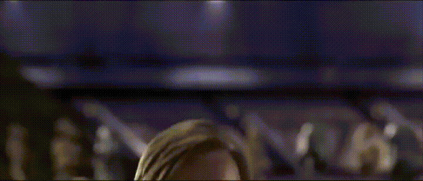
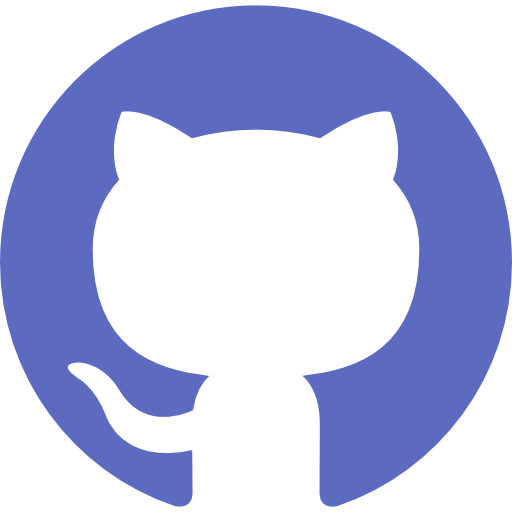
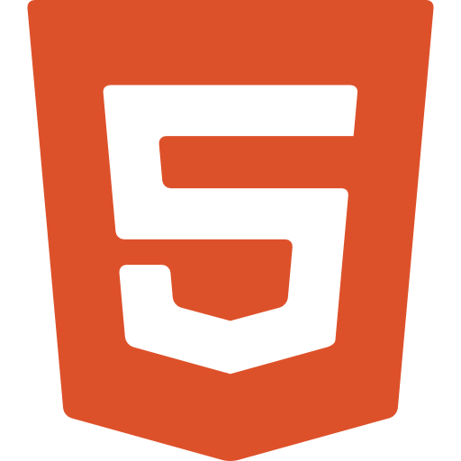
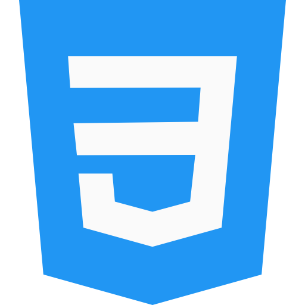

___
## Hello there! 👋

___
## Mon portfolio
[Voir le site en ligne](https://damien-trouart.github.io/portfolio/)

___
## Mes experiences

* ### Apple Fondation Program:  
Initiation au **Swift** , **SwiftUI**  
Maquettage et développement de la partie front-end d'une application en groupe 
[Repo de l'application]()

* ### Formation développeur Intégrateur:  
**Git** / **Github** , **Html** , **CSS**  , **Scss**  , initiation à **Javascript**   
[Premier projet - Découverte du Scss](https://github.com/BouchartLaurine/brief-g2)  
[Deuxième projet - Le responsive et première utilisation de JS](https://github.com/Damien-Trouart/brief_co2web)  
[Stage - Refonte totale d'un site nocode en HTML, CSS, JS et responsive pour une cliente créatrice de robes de mariée👰👗](https://github.com/Damien-Trouart/boutique-robe-mariage)

* ### Formation développeur web web/mobile fullstack:  
**Javascript** , **Typescript** , **SQL** , **PHP**   
Vue d'ensemble des fondamentaux front-end, back-end et bases de données pour produire des sites dynamiques fonctionnels  
[🏗️ En développement 👷 - Projet recoupant toutes les notions principales abordées durant la formation : site de backlog de jeux vidéos 🎮🗂️✅](https://github.com/Damien-Trouart/games-vault)

___

<!--
**Damien-Trouart/Damien-Trouart** is a ✨ _special_ ✨ repository because its `README.md` (this file) appears on your GitHub profile.

Here are some ideas to get you started:

- 🔭 I’m currently working on ...
- 🌱 I’m currently learning ...
- 👯 I’m looking to collaborate on ...
- 🤔 I’m looking for help with ...
- 💬 Ask me about ...
- 📫 How to reach me: ...
- 😄 Pronouns: ...
- ⚡ Fun fact: ...
-

